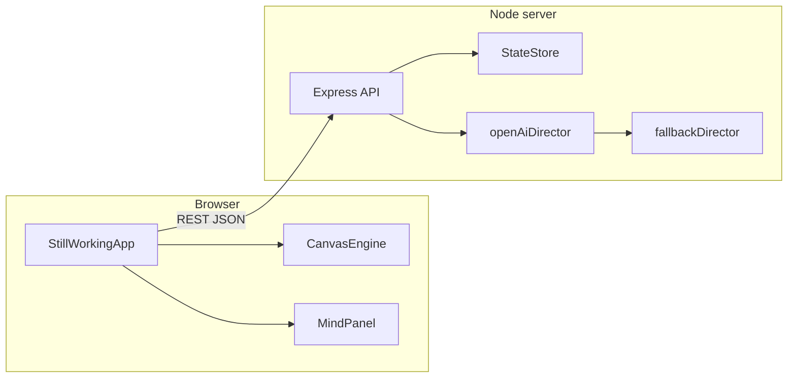

# Still Working

A small **installation-style web piece**: a living HTML canvas is steered by an **artist-director** that issues discrete painting commands on a timer. The director can be **OpenAI** (structured JSON over the Chat Completions API) or a **local fallback** that mimics the same schema with rule-based randomness—so the piece runs with or without an API key.

The UI pairs a **main painting surface** with a **mind panel** that shows the current internal “thought,” mood, and whether the last decision came from the model or the fallback.

## Why it exists

The project explores **process over polish**: visible revision, regional density, scars, washes, and pauses. The director is prompted to sound like a studio voice (concrete, self-critical, occasionally destructive) rather than gallery copy. That constraint lives in the server-side system prompt and is echoed in the fallback thought bank.

## What you will see

- A **nine-region** grid the engine uses for targeting (top_left … bottom_right).
- **Moods** (`calm`, `restless`, `frustrated`, `dreaming`, `obsessive`) that influence pacing and palette hints.
- **Actions** such as `stroke_line`, `wash_region`, `erase_region`, `blur_region`, `scar_region`, `darken_region`, `lighten_region`, `add_texture`, `pull_color`, `revisit_region`, `interrupt_canvas`, and `pause_and_observe`.
- **Persistent state** under `data/` (gitignored): canvas summary, recent actions, and thought history survive restarts when the server writes JSON.

## Architecture



1. The client loads **`GET /api/state`** and **`GET /api/runtime`** on boot.
2. The **director loop** calls **`POST /api/director/next`** with the current canvas state (or lets the server load state from disk when the body omits it).
3. The server returns a validated **`ArtistCommand`** and a **`source`** flag (`openai` | `fallback`).
4. The client renders the command on the canvas and, when the animation work finishes, calls **`POST /api/state/action-completed`** so the store can append history and update regions.

## Requirements

- **Node.js** 20+ recommended (ES modules, `fetch` in Node).
- An **OpenAI API key** only if you want model-backed direction (`USE_OPENAI=true`).

## Quick start

```bash
npm install
cp .env.example .env
# Optional: set OPENAI_API_KEY in .env
npm run dev
```

Then open **http://localhost:3000** (or the port you set in `PORT`).

- **Dev** runs the API with `tsx watch` and the Vite client with HMR.
- **Production**: `npm run build && npm start` serves the built static client from the compiled server.

## Configuration

Copy `.env.example` to `.env`. Never commit `.env`.

| Variable | Purpose |
| -------- | ------- |
| `OPENAI_API_KEY` | Bearer token for OpenAI. Empty ⇒ fallback director only (unless `USE_OPENAI=false`). |
| `OPENAI_MODEL` | Chat model id (default in code: `gpt-4.1-mini`). |
| `USE_OPENAI` | Set to `false` to skip the API even if a key is present. |
| `PORT` | HTTP port (default `3000`). |
| `INSTALLATION_MODE` | Default mode sent to the director: `studio`, `restless`, `dream`, `brutalist`, or `memory`. |
| `DIRECTOR_INTERVAL_MIN_MS` / `DIRECTOR_INTERVAL_MAX_MS` | Bounds (ms) exposed to the client for pacing between commands; the client uses a capped random delay in its loop. |

## HTTP API

All routes accept/return JSON. Errors are `500` with `{ "error": "message" }`.

### `GET /api/state`

Returns the current **`CanvasState`**: moods, per-region stats, recent actions/thoughts, `artistTaste`, counters, timestamps.

### `GET /api/runtime`

Returns non-secret runtime flags: `installationMode`, director interval bounds, and `openAiConfigured` (boolean: key present and OpenAI enabled).

### `POST /api/director/next`

Body (optional fields):

```json
{
  "canvasState": { "...": "full CanvasState if you want to bypass server snapshot" },
  "installationMode": "studio"
}

```

Response:

```json
{
  "command": {
    "mood": "restless",
    "thought": "break the balance before it gets too polite",
    "action": "stroke_line",
    "targetRegion": "center",
    "intensity": 0.62,
    "durationMs": 5200,
    "colorMood": "warm",
    "secondaryRegion": "middle_right"
  },
  "source": "openai"
}
```

Commands are **validated and clamped** on the server; malformed model output is replaced with a safe fallback command.

### `POST /api/state/action-completed`

Body: `{ "command": ArtistCommand, "regionUpdates": { "center": { "density": 0.4, "contrast": 0.55 } } }` (region updates optional). Returns the updated **`CanvasState`**.

## Client debugging

Append **`?debug=true`** to the URL to show a small JSON panel with the last command, totals, and whether OpenAI was configured on the server.

## Project layout

| Path | Role |
| ---- | ---- |
| `shared/types.ts` | Shared TypeScript types for state and commands. |
| `server/` | Express app, OpenAI + fallback directors, validation, state persistence. |
| `client/` | Vite + TypeScript client; canvas engine and mind UI. |
| `data/` | Runtime JSON state (ignored by git except what you add locally). |

## Scripts

| Script | Description |
| ------ | ----------- |
| `npm run dev` | Concurrent API + Vite dev servers. |
| `npm run build` | Production build of client and server. |
| `npm start` | Run compiled server from `dist/`. |
| `npm test` | Typecheck client and server. |

## Security notes

- The OpenAI key lives **only** on the server in `.env`. The client never sees it; it only sees `openAiConfigured`.
- Do not expose this server directly to untrusted networks without hardening (rate limits, auth, HTTPS termination, etc.). This repository is an **art/demo** stack, not a hardened multi-tenant product.

## License

MIT — see [LICENSE](./LICENSE).
